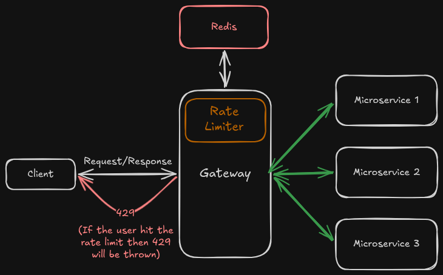
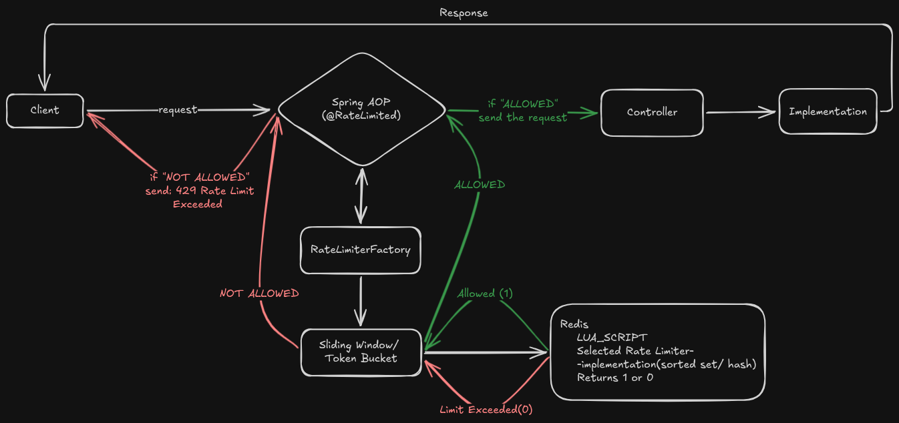
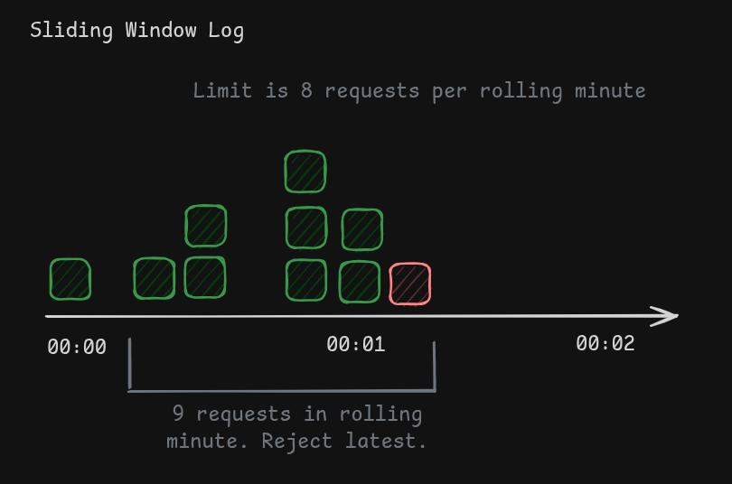
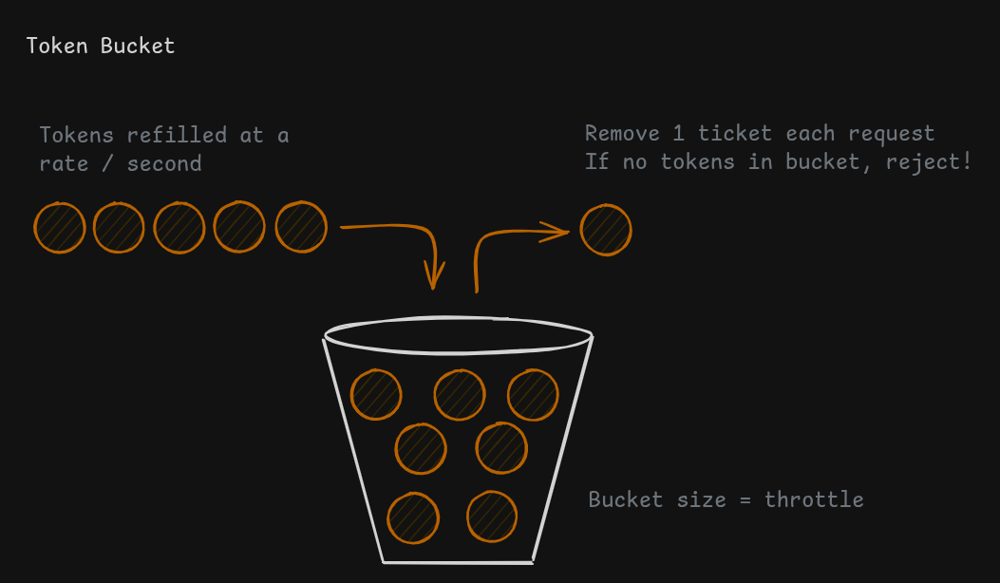

# Rate Limiter as a Service

[](https://www.java.com)
[](https://spring.io/projects/spring-boot)
[](https://redis.io)
[]()

A production-grade, distributed rate limiting service built with Spring Boot and Redis. This project provides a configurable, high-performance solution for protecting APIs from overuse and ensuring fair usage, designed to be deployed as a standalone API Gateway or integrated as a library.

## Key Features

- **Multiple Algorithm Support**: Implements both **Token Bucket** and **Sliding Window Log** algorithms, configurable per API endpoint.
- **Distributed & Scalable**: Leverages Redis for centralized state management, making the service horizontally scalable.
- **Atomic Operations**: Guarantees thread-safety and prevents race conditions under extreme concurrent load by using **Redis Lua Scripts** and atomic commands.
- **Configuration Driven**: Rate limiting plans (capacity, time window, algorithm) are defined externally in `application.yaml`, requiring no code changes to modify or add new plans.
- **Clean Architecture**: Utilizes Spring AOP for non-invasive application of rate limits and a Strategy Pattern (`RateLimiterFactory`) for clean separation of algorithmic logic.
- **Production-Ready Testing**: Includes a comprehensive integration test suite that verifies atomicity, user isolation, and window expiration under a simulated "thundering herd" of concurrent requests.

---

## Architecture

### High-Level Design (API Gateway Pattern)

Usually the Rate Limiter service is designed to function as an API Gateway, sitting in front of backend microservices. It intercepts all incoming requests, applies the appropriate rate limit, and either proxies the request to the upstream service or rejects it with an `HTTP 429 Too Many Requests` status.



*Figure 1: API Gateway implementation architecture.*

### Internal Design (Strategy Pattern)

Internally, the service uses the Strategy Pattern to dynamically select the correct rate-limiting algorithm at runtime based on the configuration provided for a given API plan.

1.  An incoming request to a controller method annotated with `@RateLimited(plan = "...")` is intercepted by the `RateLimiterAspect`.
2.  The Aspect asks the `RateLimiterFactory` for the limiter associated with the specified plan.
3.  The Factory, having read the `application.yaml` properties at startup, returns the pre-configured `RateLimiter` implementation (e.g., `RedisSlidingWindowRateLimiter`).
4.  The Aspect invokes `isAllowed()` on the returned implementation.



*Figure 2: Current implementation architecture.*

---

## Algorithms & Data Structures

This project demonstrates a deep understanding of the trade-offs between different rate-limiting algorithms.

### 1. Sliding Window Log (High Accuracy)

-   **Use Case**: Ideal for security-sensitive endpoints where the rate limit must be strictly enforced (e.g., login attempts, OTP generation).
-   **Redis Data Structure**: `Sorted Set (ZSET)`
    -   Each request is stored as a member in the ZSET with its timestamp as the score.
    -   This provides perfect accuracy over a rolling window but has a higher memory footprint (O(N), where N is the number of requests in the window).
-   **Atomicity**: Achieved by executing `ZREMRANGEBYSCORE`, `ZCARD`, and `ZADD` within a single, atomic Redis transaction to prevent race conditions.
    

    *Figure 3: Sliding Window Algorithm.*

### 2. Token Bucket (High Performance)

-   **Use Case**: Perfect for high-throughput, general-purpose API throttling where allowing for bursts of traffic is desirable and memory efficiency is critical.
-   **Redis Data Structure**: `Hash`
    -   Only two fields are stored per user: `tokens` and `last_refill_timestamp`. This is extremely memory-efficient (O(1)).
-   **Atomicity**: The entire get-refill-consume logic is encapsulated in a **Redis Lua Script**. Redis guarantees that the entire script is executed atomically, making it impossible for concurrent requests to corrupt the bucket's state.
    

    *Figure 4: Token Bucket Algorithm.*
---

## Technology Stack

-   **Language**: Java 17
-   **Framework**: Spring Boot 3.4.5
-   **Database**: Redis 7.x (via Redis Cloud & Docker)
-   **Core Libraries**:
    -   Spring Data Redis (for Redis communication)
    -   Spring AOP (for intercepting requests)
    -   Spring Web
-   **Testing**: JUnit 5, Spring Boot Test, TestRestTemplate
-   **Build**: Maven

---

## Configuration

Rate limiting plans are defined in `src/main/resources/application.yaml`. This allows for easy modification without redeploying code.

```yaml
rate-limiting:
  plans:
    # High-accuracy plan for a critical endpoint
    premium:
      algorithm: SLIDING_WINDOW_REDIS
      capacity: 5
      refill-period: 1 # This is the window size
      time-unit: MINUTES

    # High-throughput plan using the memory-efficient algorithm
    free:
      algorithm: TOKEN_BUCKET_REDIS
      capacity: 100
      refill-rate: 100
      refill-period: 1
      time-unit: MINUTES
```

---

## Testing Strategy

The project includes a production-grade integration test suite (`RateLimiterComprehensiveIntegrationTest.java`) that validates the system's correctness under pressure.

-   **Atomicity & Concurrency**: Simulates a "thundering herd" of 100+ concurrent threads using `ExecutorService` and `CountDownLatch` to verify that the number of allowed requests exactly matches the configured capacity, proving the absence of race conditions.
-   **User Isolation**: Tests that rate-limiting one user has zero impact on the limit of another user.
-   **Window Expiration**: Validates that after a time window expires, the limit is correctly reset.
-   **End-to-End HTTP Testing**: Uses `TestRestTemplate` to send real HTTP requests to the running application, verifying that the entire flow—from AOP interception to the final HTTP 429 response—works as expected.
-   **Redis Cleanup**: All tests automatically clean up the keys they create in the Redis database via an `@AfterEach` hook.

---

## How to Run

### Prerequisites

-   Java 17+
-   Maven 3.6+
-   Docker
-   Redis 7+

### 1. Running with Local Redis (Docker)

The default configuration is set up to connect to a local Redis instance.

1.  **Start Redis in Docker:**
    ```bash
    docker run --name my-redis -p 6379:6379 -d redis
    ```

2.  **Run the Spring Boot application:**
    ```bash
    mvn spring-boot:run
    ```

### 2. Running with Redis Cloud

1.  Create a file `src/main/resources/application-cloud.yaml` with your Redis Cloud credentials:
    ```yaml
    spring:
      data:
        redis:
          host: your-redis-cloud-host.db.redis.io
          port: your-port
          password: your-password
    ```

2.  Run the application with the `cloud` profile active:
    ```bash
    mvn spring-boot:run -Dspring.profiles.active=cloud -Djava.net.preferIPv4Stack=true
    ```

### API Endpoints

-   `GET /api/v1/premium-data`: Protected by the `premium` (Sliding Window) plan.
-   `GET /api/v1/free-data`: Protected by the `free` (Token Bucket) plan.